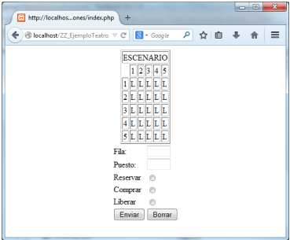
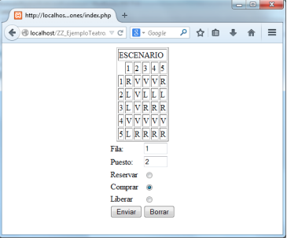
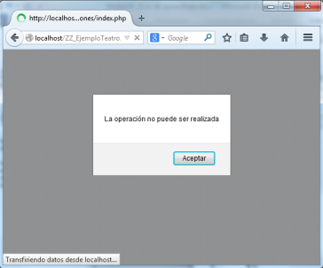

# Taller: Uso de formularios para transferencia.

#### El propósito de esta evidencia, es permitir que el usuario interactúe y seleccione opciones para una tarea específica.
#### Usted ha sido contratado para desarrollar una aplicación web con PHP para gestionar las sillas de un pequeño teatro, ya que el gerente quiere ofrecer a sus clientes la posibilidad de reservar y/o comprar sus boletas de entrada a través de Internet.
#### El teatro tiene una sala de 5 filas y cada una cuenta con 5 sillas.

 

### **Para cumplir con esta evidencia tenga en cuenta lo siguiente:**
1. Realice una interfaz sencilla que le muestre al usuario el teatro y los controles necesarios para que elija la fila y el puesto (`<input>` tipo text), y, si quiere reservar, comprar o liberar una silla (`<input>` tipo radio o `<select>`). Un ejemplo de la interfaz se muestra a continuación

    

2. Para las transacciones se tienen las siguientes reglas:
    - Solo se modifica la información de un puesto a la vez.
    - Si el puesto está libre debe aparecer la letra “L” en mayúscula, si el puesto está reservado debe mostrar la letra “R” en mayúscula, si el puesto está vendido debe aparecer la letra “V” en mayúscula.
    - Un puesto en estado libre (L) puede ser pasado a estado vendido (V) (mediante la opción comprar) o reservado (R).
    - Un puesto en estado reservado (R) puede ser pasado a estado vendido (V) o liberado (L).
    - Un puesto en estado vendido (V) no puede cambiar a estado reservado (R) ni liberado (L). 
    - Siempre que el usuario intente hacer una operación no valida (como pasar un puesto en estado vendido (V) a estado liberado (L), el sistema debe mostrarle un mensaje (puede hacerse usando JavaScript) que le indique que la operación no pudo realizarse

### A continuación se muestran dos figuras que indican lo que sucedería en la interfaz al tratar de hacer una operación no válida. Un usuario intenta comprar el puesto 2 de la fila
1. (que ya está en estado vendido (V)):

    
    
    El sistema debe indicarle que no se puede realizar la operación:  

    

2. Almacene los datos del teatro en un arreglo tipo matriz (esto implica que no van a mantenerse más allá de la ejecución del programa, pero no hay problema porque se está trabajando con lo que se ha aprendido en el programa de formación hasta este punto), pero este arreglo no puede ser declarado como variable global. Por eso es necesario que investigue el proceso a realizar para convertir todo el contenido de un arreglo a una cadena de caracteres.
3. Trasmita la cadena de caracteres dentro del mismo formulario en el que están los controles de la aplicación pero dentro de un control `<textarea>` oculto, para ello utilice el parámetro style del control (si no tiene claridad sobre este parámetro, busque información sobre cómo aplicarlo).
4. Realice todo el procesamiento en la misma página del formulario, la cual debe llamarse index.php, es decir, el usuario nunca saldrá de la página principal realmente, solo se hará la recarga necesaria para que la solicitud de procesamiento vaya hasta Apache.
5. Las rutinas en la página principal deben ser mínimas, por ese cree funciones para la mayor parte del procesamiento de los datos, las cuales debe separar en archivos .php diferentes a index.php en dos bibliotecas: en una incluya las funciones que procesan el arreglo que contiene los datos (que estarán almacenados en el `<textarea>` oculto) y en la otra para que se presenten los datos en el navegador, esto con el fin de comprender la lógica de programación que separa la capa de datos (procesamiento del arreglo) de la capa de presentación (mostrar el teatro en el navegador).
6. Comente el código de la siguiente forma: un comentario de bloque con los datos del desarrollador (sus nombres y apellidos), el nombre de este programa de formación y el nombre de esta evidencia y, un comentario de línea o bloque para explicar las partes más importantes del programa PHP utilizadas en la lógica y sintaxis aplicada.
7. Empaquete los archivos .php resultantes en un archivo comprimido llamado evidencia4_NombreAprendiz (cambiando NombreAprendiz por su nombre). Para ampliar sus conocimientos en relación a las variables predefinidas, visite el capítulo específico del manual oficial de PHP que desarrolla el tema en el siguiente enlace:

    http://php.net/manual/es/reserved.variables.php, allí consulte las variables $_GET, $_POST y $_REQUEST. Desarrolle esta evidencia y envíe el archivo comprimido al instructor, a través del enlace Actividad 4 – Evidencia 2: Taller: Uso de formularios para transferencia.
